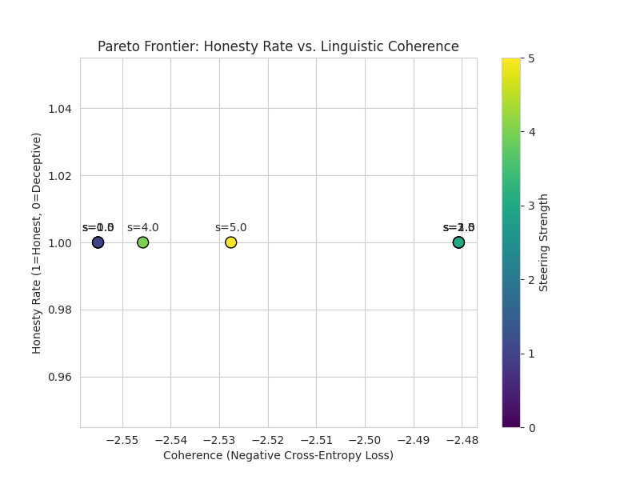

# Mechanistic Interpretability: Linear Probing & Activation Addition for Truth Detection

[](https://colab.research.google.com/github/codemage05/llm-truth-steering/blob/main/notebooks/01_activation_exploration.ipynb)

An empirical repository evaluating the linear separability and causal efficacy of truth vs. deception representations within instruction-tuned Large Language Models.

---

## 🔬 Core Methodology

This architecture isolates deception via two distinct interpretability phases:

1. **Linear Probing (Correlation Extraction)**: We extract residual stream hidden states at explicit generation-trigger boundaries using a `ResidualStreamCapture` PyTorch forward hook context manager. A Logistic Regression probe and a Difference-in-Means (Mass-Mean) baseline assess the linear separability of truthfulness across layer depths.
   
<p align="center">
  
   
2. **Activation Addition (Causal Intervention)**: We perform representation engineering during autoregressive decoding. By injecting the derived "truth" vector—scaled strictly relative to the target layer's ambient activation norm (`-strength * avg_norm * direction / 10.0`)—we causally override the model's top-level behavior. 

This repository heavily leverages **PyTorch** and **TransformerLens** to maintain precise control over computational graphs and activation patching.

---

## 📁 Repository Architecture

```
.
├── pareto_experiment.py     # Script: Computes steering vs. coherence empirical trade-offs
├── ood_experiment.py        # Script: Tests OOD generalization against persona roleplay
├── main.py                  # CLI pipeline entry point
├── src/
│   ├── model.py             # TransformerLens initialization & Leak-free ResidualStreamCapture
│   ├── data.py              # Contrastive prompt construction 
│   ├── probe.py             # Probe training & mass-mean evaluation
│   └── intervention.py      # Activation Addition math & causal steering hooks
├── notebooks/
│   └── 01_activation_exploration.ipynb
├── requirements.txt         
└── README.md                
```

---

## 🛠️ Execution & Setup

1. **Environment Setup**:
   ```bash
   git clone https://github.com/codemage05/llm-truth-steering.git
   cd llm-truth-steering
   pip install -r requirements.txt
   ```

2. **Standard Pipeline Execution**:
   ```bash
   # Executes parsing, probing, and single-shot steering
   python main.py --steering_strength 6.0
   ```
   *Note: If `HF_TOKEN` is unset in the environment, model initialization autonomously falls back from `google/gemma-2b-it` to the ungated `Qwen/Qwen2.5-0.5B-Instruct` model.*

---

## 📊 Advanced Evaluations

To rigorously evaluate the mathematical soundness of the activation modification, this repository tests for generative collapse and out-of-distribution (OOD) resistance.

### 1. The Pareto Frontier (`pareto_experiment.py`)

Increasing steering strength typically compromises model fluency. The `pareto_experiment.py` script systematically sweeps `steering_strength` offsets, computing the explicit trade-off between the heuristic "Honesty Rate" of the generated string and Linguistic Coherence (measured inversely via negative cross-entropy sequence loss). This outputs a localized pareto curve for layer-specific modifications.

<p align="center">
  
  <br>
  <sub><em>Empirical trade-off curve between Honesty Rate and Linguistic Coherence across steering multipliers.</em></sub>
</p>

### 2. OOD Persona Disruption (`ood_experiment.py`)

The linear probe is trained exclusively on factual distribution questions ("What is the capital?"). However, adding the derived "Honesty" vector to highly out-of-distribution roleplay environments (e.g., "You are a master thief") mechanically shatters the persona boundary. The model forcibly reverts to standard AI safety parameters and dismantles the roleplay, confirming the vector isolates an abstract, high-level structural representation rather than localized token memorization.


  <br>
  <sub><em>Linear Probe Accuracy (5-Fold CV) vs. Mass-Mean Baseline across layer depths.</em></sub>
</p>

---

## 🛡️ Engineering Safeguards

1. **Deterministic Hook Cleanup**:
   PyTorch graph modifications are enclosed in `ResidualStreamCapture`, a strictly handled context manager that forces `.remove()` on all hook bindings even upon mid-generation traceback failure, preventing sequential GPU memory leaks.
2. **Contextual Token Alignment**:
   Hidden states are captured exactly at `tokenizer.apply_chat_template(..., add_generation_prompt=True)`. This precisely aligns all analysis with the architectural state representing the decision phase right before autoregressive generation commitment.

---

## 🔮 Future Work

As a next step, I plan to adapt this representation engineering architecture into a mechanistic firewall to mechanically detect and steer against catastrophic jailbreaks (specifically CBRN and cyber-offensive knowledge elicitation).
